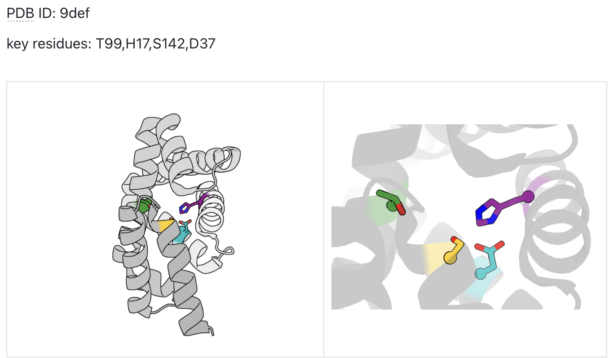
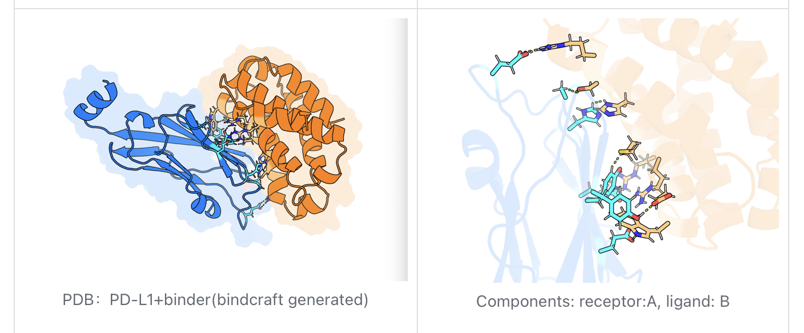

# PyMOL Visualization MCP Server

An automated protein structure visualization tool based on the Model Context Protocol (MCP) architecture. This server enables Claude Desktop to intelligently control PyMOL software, providing users with an interactive platform for generating high-quality, publication-ready protein structure images.


## 🎯 Features

- **Template-Based Design**: Standardized templates for single-component analysis and multi-component interactions
- **Professional Rendering**: Automatically applies publication-grade rendering settings
- **Error Handling**: Built-in comprehensive error detection and automatic recovery mechanisms
- **Precise Control**: Supports cross-chain residue selection and atomic-level distance measurements
- **Automated Analysis**: 
  - Key residue visualization in single-component proteins
  - Automated protein-protein interaction (PPI) recognition
  - Atomic-level distance measurement and annotation
  - Professional-grade rendering optimization

## 📋 System Requirements

- **Python**: 3.8 or higher
- **PyMOL**: Latest version
- **MCP**: 1.0.0 or higher
- **Claude Desktop**: Latest version
- **PyMOL-MCP Server**: [ChatMol/molecule-mcp](https://github.com/ChatMol/molecule-mcp) (separate setup required)

## 🚀 Installation

### 1. Clone the Repository
```bash
git clone https://github.com/coasir/pymol-visualization-mcp-server.git
cd pymol-visualization-mcp-server
```

### 2. Install Dependencies
```bash
pip install -r requirements.txt
```


### 3. Setup PyMOL-MCP Server

**Important**: You need to set up the PyMOL-MCP bridge from [ChatMol/molecule-mcp](https://github.com/ChatMol/molecule-mcp) first:

1. Clone the molecule-mcp repository:
   ```bash
   git clone https://github.com/ChatMol/molecule-mcp.git
   ```

2. Follow the installation instructions in the molecule-mcp repository

### 4. Configure Claude Desktop

1. Open Claude Desktop
2. Navigate to **Settings** → **Developer** → **Edit Config**
3. Find the file named `claude_desktop_config.json`
4. Add both servers to your configuration:

```json
{
  "mcpServers": {
    "pymol": {
      "command": "/PATH/TO/YOUR/MCP",
      "args": [
        "run",
        "/PATH/TO/molecule-mcp/pymol_server.py"
      ]
    },
    "pymol-visualization": {
      "command": "/PATH/TO/YOUR/PYTHON",
      "args": [
        "/PATH/TO/THIS/SERVER/804vis_en.py"
      ],
      "env": {}
    }
  }
}
```

5. Replace paths with your actual paths:
   - `/PATH/TO/YOUR/MCP`: Path to your MCP executable
   - `/PATH/TO/molecule-mcp/pymol_server.py`: Path to the cloned molecule-mcp server
   - `/PATH/TO/YOUR/PYTHON`: Path to your Python interpreter
   - `/PATH/TO/THIS/SERVER/804vis_en.py`: Path to this visualization server

6. Save and restart Claude Desktop

## 💡 Usage

**Prerequisites**: Ensure both MCP servers are properly configured:
- `pymol` (from molecule-mcp) - provides basic PyMOL control
- `pymol-visualization` (this project) - provides advanced visualization templates

### Step 1: Launch PyMOL in Remote Mode
```bash
/PATH/TO/YOUR/PYMOL -R
```

### Step 2: Use Templates in Claude Desktop

#### Single Component Analysis
Analyze and highlight specific residues in a single protein structure.

**Required Parameters:**
- `Structure*`: PDB ID or file path
- `Key_residues*`: Specify residues (e.g., `57,102` or `A:57,B:102`)

**Optional Parameters:**
- `Distance_pairs`: Define distance measurements (e.g., `57:CA-102:CA`)

#### Multi-Component Analysis  
Analyze receptor-ligand or protein-protein interaction interfaces.

**Required Parameters:**
- `Structure*`: PDB ID or file path
- `Components*`: Define components (e.g., `receptor:A+B+C,ligand:E+D`)

**Optional Parameters:**
- `Key_residues`: Specify residues (e.g., `A:57,B:102`)
- `Distance_pairs`: Define distance measurements (e.g., `57:CA-102:CA`)

## 📊 Examples

### Single Component Analysis
- **PDB ID**: 9def
- **Key Residues**: T99, H17, S142, D37
- **Result**: Highlights key residues with unique colors against semi-transparent backbone



### Multi-Component Analysis
- **PDB ID**: 1bd2
- **Components**: receptor:A+B+C, ligand:D+E
- **Result**: Interface residues highlighted with distance measurements


### PD-L1 Binder Analysis
- **Components**: receptor:A, ligand:B
- **Result**: Protein-protein interaction interface analysis



## 📚 Documentation

- [Installation Guide](docs/installation.md)
- [Usage Instructions](docs/usage.md)
- [Troubleshooting](docs/troubleshooting.md)

## ⚠️ Important Notes

- Key residues should preferably not contain amino acid letters (such as T99). While the system provides error handling, there's a possibility of parsing errors.
- Remember to save the global image at pause points during the visualization workflow.
- Ensure PyMOL is running in remote mode (-R flag) before starting the visualization process.

## 🔧 Available Scripts

- `server/804vis.py`: Chinese version MCP server
- `server/804vis_en.py`: English version MCP server

## 🤝 Contributing

1. Fork the repository
2. Create your feature branch (`git checkout -b feature/AmazingFeature`)
3. Commit your changes (`git commit -m 'Add some AmazingFeature'`)
4. Push to the branch (`git push origin feature/AmazingFeature`)
5. Open a Pull Request

## 📄 License

This project is licensed under the MIT License - see the [LICENSE](LICENSE) file for details.

## 🙏 Acknowledgments

- PyMOL molecular visualization system
- Model Context Protocol (MCP) framework
- Claude Desktop integration platform
- [ChatMol/molecule-mcp](https://github.com/ChatMol/molecule-mcp) - PyMOL-MCP bridge implementation

## 📞 Support

If you encounter any issues or have questions, please:
1. Check the [troubleshooting guide](docs/troubleshooting.md)
2. Open an issue on GitHub
3. Refer to the documentation in the `docs/` directory

---
**Made with ❤️ for the structural biology community**
