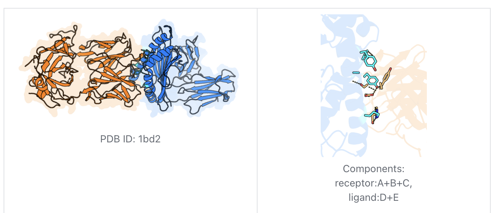

# Multi-Component Analysis Example: PDB 1bd2

This example demonstrates the multi-component interaction analysis template for studying protein-protein interfaces.

## Overview

- **PDB ID**: 1bd2
- **Analysis Type**: Multi-component interaction analysis
- **Components**: 
  - Receptor: Chains A+B+C
  - Ligand: Chains D+E
- **Purpose**: Analyze protein complex interface and interactions

## Step-by-Step Process

### 1. Launch PyMOL
```bash
pymol -R
```

### 2. Configure Analysis in Claude Desktop

**Template**: `multi_component_analysis`

**Parameters**:
- **Structure**: `1bd2`
- **Components**: `receptor:A+B+C,ligand:D+E`
- **Key_residues**: (Optional) `A:100,D:50`
- **Distance_pairs**: (Optional) `A:100:CA-D:50:CA`

### 3. Expected Results

The visualization will show:
- **Distinct component coloring**: Receptor and ligand in different colors
- **Interface highlighting**: Automatic identification of interface residues
- **Surface representation**: Semi-transparent surfaces for both components
- **Distance measurements**: Quantitative interaction data
- **Stick representation**: Interface residues shown as sticks

## Visual Output



**Figure Description**:
- Left panel: Overall complex structure showing distinct coloring of receptor (orange) and ligand (blue) components
- Right panel: Interface region with highlighted interaction residues and distance measurements

## Key Features Demonstrated

1. **Automatic Interface Detection**: Script identifies residues at the protein-protein interface
2. **Component Separation**: Clear visual distinction between receptor and ligand
3. **Distance Quantification**: Precise measurements between interacting residues
4. **Surface Complementarity**: Semi-transparent surfaces show shape complementarity
5. **Interface Residues**: Stick representation highlights key interaction points

## Technical Details

### Component Definition
- **Receptor (A+B+C)**: Multi-chain protein complex forming one functional unit
- **Ligand (D+E)**: Two-chain binding partner

### Interface Analysis
- **Automatic Detection**: Algorithm identifies residues within interaction distance
- **Distance Cutoff**: Typically 4-5 Å for interface residue identification
- **Color Coding**: Interface residues use cyan (receptor) and light orange (ligand)

### Rendering Features
- **Surface Transparency**: Allows visualization of internal interface residues
- **Stick Representation**: Interface residues shown with atomic detail
- **Distance Labels**: Key interactions labeled with precise measurements
- **Professional Lighting**: Optimized for publication-quality output

## Interface Analysis Results

### Key Interactions Identified
- **Hydrogen Bonds**: Polar residue interactions
- **Hydrophobic Contacts**: Non-polar residue clustering
- **Electrostatic Interactions**: Charged residue pairs
- **Van der Waals Contacts**: Close atomic approaches

### Quantitative Data
- **Interface Area**: Calculated buried surface area
- **Binding Residues**: Number of residues contributing to interface
- **Critical Distances**: Key atomic separations measured and displayed

## Usage Applications

### Protein Design
- Identify hot spots for mutagenesis
- Design interface modifications
- Predict binding affinity changes

### Drug Discovery
- Identify druggable pockets at interfaces
- Design protein-protein interaction inhibitors
- Analyze binding specificity

### Structural Biology
- Compare related complexes
- Understand evolution of binding specificity
- Validate structural models

## Customization Options

### Focus on Specific Regions
```
Structure: 1bd2
Components: receptor:A+B+C,ligand:D+E
Key_residues: A:150,A:200,D:75,D:100
Distance_pairs: A:150:CA-D:75:CA,A:200:CA-D:100:CA
```

### Alternative Component Definitions
```
# If treating as individual chains
Components: receptor:A,ligand:B

# Complex with cofactors
Components: protein:A+B,cofactor:C,substrate:D
```

### Extended Distance Analysis
```
Distance_pairs: A:150:CA-D:75:CA,A:150:CB-D:75:CB,A:200:N-D:100:O
```

## Comparison with Related Structures

This analysis approach can be applied to:
- **Homologous complexes**: Compare binding modes
- **Mutant structures**: Assess interaction changes  
- **Different conformations**: Study flexibility effects
- **Orthologous proteins**: Understand species differences

## Export and Documentation

### High-Resolution Images
```python
# In PyMOL
ray 2400, 2400
png complex_interface.png, dpi=300
```

### Data Export
```python
# Distance measurements
distance interface_dist, A:150:CA, D:75:CA
# Interface residue list
select interface, byres(receptor within 5 of ligand)
```

## Next Steps

1. **Modify Components**: Try different chain combinations
2. **Add Measurements**: Include more distance pairs
3. **Compare Conditions**: Analyze before/after binding states
4. **Publication Prep**: Generate multiple viewing angles

## Related Examples

- [Single Component: 9def](../single_component/9def_example.md)
- [PD-L1 Binder Complex](pdl1_binder_example.md)

## References

- Original structure: [PDB 1bd2](https://www.rcsb.org/structure/1bd2)
- Interface analysis methods
- Protein-protein interaction databases
