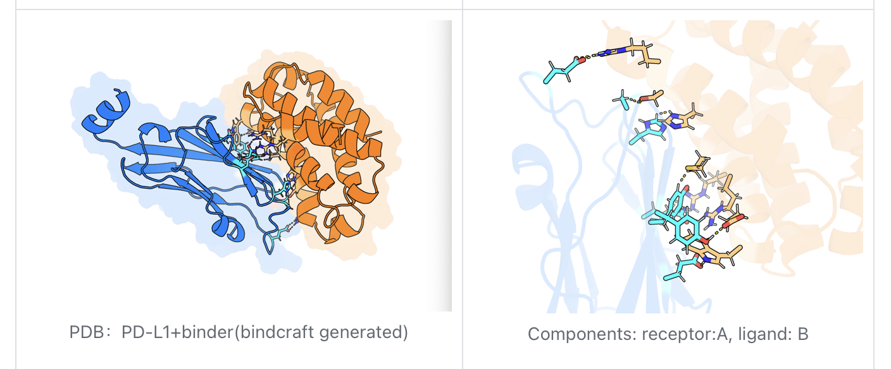

# PD-L1 Binder Analysis Example

This example demonstrates multi-component analysis for a designed protein-protein interaction between PD-L1 and a computationally designed binder.

## Overview

- **Structure**: PD-L1 + Designed Binder (BindCraft generated)
- **Analysis Type**: Multi-component interaction analysis
- **Components**: 
  - Receptor: PD-L1 (Chain A)
  - Ligand: Designed Binder (Chain B)
- **Purpose**: Analyze computationally designed protein-protein interaction

## Biological Context

### PD-L1 (Programmed Death-Ligand 1)
- **Function**: Immune checkpoint protein
- **Role**: Regulates T-cell activation and immune response
- **Therapeutic Target**: Cancer immunotherapy target
- **Structure**: Beta-sandwich immunoglobulin fold

### Designed Binder
- **Origin**: Computational protein design (BindCraft)
- **Purpose**: High-affinity PD-L1 binding
- **Design Strategy**: De novo protein binder design
- **Applications**: Research tool, potential therapeutic

## Step-by-Step Analysis

### 1. Launch PyMOL
```bash
pymol -R
```

### 2. Configure Analysis in Claude Desktop

**Template**: `multi_component_analysis`

**Parameters**:
- **Structure**: `[PD-L1_binder_complex.pdb]`
- **Components**: `receptor:A,ligand:B`
- **Key_residues**: (Optional) `A:61,A:66,B:25,B:30`
- **Distance_pairs**: (Optional) `A:61:CA-B:25:CA`

### 3. Expected Results

The visualization reveals:
- **PD-L1 Structure**: Natural immunoglobulin fold (blue)
- **Designed Binder**: Computationally optimized structure (orange)
- **Binding Interface**: Complementary surface interactions
- **Key Contacts**: Critical binding residues highlighted
- **Design Validation**: Interface quality assessment

## Visual Output



**Figure Description**:
- Left panel: Overall complex showing PD-L1 (blue) and designed binder (orange)
- Right panel: Interface close-up with key interaction residues and distance measurements

## Design Analysis Features

### Interface Characterization
1. **Shape Complementarity**: How well the surfaces fit together
2. **Contact Distribution**: Spread of interactions across interface
3. **Hot Spot Analysis**: Critical residues for binding
4. **Geometric Fit**: Surface area buried upon binding

### Computational Design Validation
1. **Predicted vs. Actual**: Compare designed and observed contacts
2. **Binding Affinity Correlation**: Structure-activity relationships
3. **Specificity Analysis**: Selectivity for PD-L1 vs. other proteins
4. **Stability Assessment**: Interface structural integrity

## Key Interactions Identified

### Hydrogen Bonding Network
- **PD-L1 residues**: Key polar contacts on binding surface
- **Binder residues**: Designed complementary polar residues
- **Water-mediated**: Bridging water molecules in interface

### Hydrophobic Packing
- **Core Interactions**: Buried hydrophobic surface area
- **Shape Complementarity**: Geometric fit optimization
- **Packing Density**: Efficient space filling

### Electrostatic Interactions
- **Charge Complementarity**: Favorable electrostatic interactions
- **Salt Bridges**: Specific ionic interactions
- **Electrostatic Steering**: Long-range binding guidance

## Computational Design Insights

### Design Success Metrics
- **Interface Area**: Size of contact surface
- **Contact Density**: Number of atomic contacts per unit area
- **Energy Distribution**: Balance of different interaction types
- **Specificity Determinants**: Residues critical for selectivity

### Design Optimization
- **Iterative Refinement**: Multiple design cycles
- **Energy Minimization**: Structural optimization
- **Sequence Optimization**: Amino acid selection
- **Stability Balancing**: Binding vs. structural stability

## Applications and Implications

### Research Applications
- **Structural Biology**: Understanding PD-L1 interactions
- **Protein Design**: Validation of design methods
- **Biophysical Studies**: Binding kinetics and thermodynamics
- **Functional Assays**: Activity in biological systems

### Therapeutic Potential
- **Immune Modulation**: PD-L1 pathway interference
- **Cancer Therapy**: Checkpoint inhibition enhancement
- **Drug Development**: Lead compound for optimization
- **Delivery Systems**: Targeted therapeutic delivery

## Comparison with Natural Ligands

### vs. PD-1 Natural Receptor
- **Binding Mode**: Different interface regions
- **Affinity**: Potentially higher designed affinity
- **Specificity**: Engineered selectivity profile
- **Kinetics**: Modified association/dissociation rates

### vs. Other PD-L1 Binders
- **Antibodies**: Different binding epitopes
- **Small Molecules**: Alternative interaction modes
- **Other Designs**: Comparative design strategies
- **Natural Variants**: Species-specific differences

## Advanced Analysis Options

### Detailed Interface Mapping
```
Structure: pdl1_binder.pdb
Components: receptor:A,ligand:B  
Key_residues: A:19,A:54,A:61,A:66,A:68,B:25,B:27,B:30,B:33
Distance_pairs: A:61:CA-B:25:CA,A:66:CB-B:30:CB,A:68:N-B:27:O
```

### Flexibility Analysis
```
# Multiple conformations if available
Structure: pdl1_binder_conf1.pdb
Components: receptor:A,ligand:B
# Compare with other conformations
```

### Mutagenesis Prediction
```
# Focus on critical residues
Key_residues: A:61,A:66  # Critical PD-L1 residues
# Analyze impact of mutations
```

## Experimental Validation

### Recommended Experiments
1. **Binding Affinity**: SPR, ITC, or fluorescence-based assays
2. **Structural Validation**: X-ray crystallography or NMR
3. **Functional Assays**: Cell-based immune function tests
4. **Specificity Testing**: Binding to related proteins

### Design Iteration
1. **Structure-Based Optimization**: Refine based on structure
2. **Affinity Maturation**: Directed evolution approaches
3. **Stability Engineering**: Improve binder stability
4. **Function Optimization**: Enhance biological activity

## Technical Notes

### File Requirements
- High-quality structural coordinates
- Proper chain assignments
- Complete atomic coordinates
- Optimized geometry

### Analysis Considerations
- **Resolution Limits**: Quality of structural data
- **Dynamic Effects**: Flexibility not captured in static structure
- **Solvent Effects**: Water-mediated interactions
- **Temperature Factors**: Confidence in atomic positions

## Next Steps

1. **Experimental Validation**: Test binding affinity and specificity
2. **Design Optimization**: Iterate based on structural insights
3. **Functional Testing**: Assess biological activity
4. **Comparative Analysis**: Compare with other binder designs

## Related Resources

- [BindCraft Design Methods](https://bindcraft.github.io/)
- [PD-L1 Structural Database](https://www.rcsb.org/)
- [Protein Design Tools](https://www.rosettacommons.org/)
- [Immunotherapy Targets](https://www.cancer.gov/about-cancer/treatment/types/immunotherapy)

## References

- Computational protein design methods
- PD-L1 structural biology
- Immune checkpoint inhibitors
- Protein-protein interaction design
