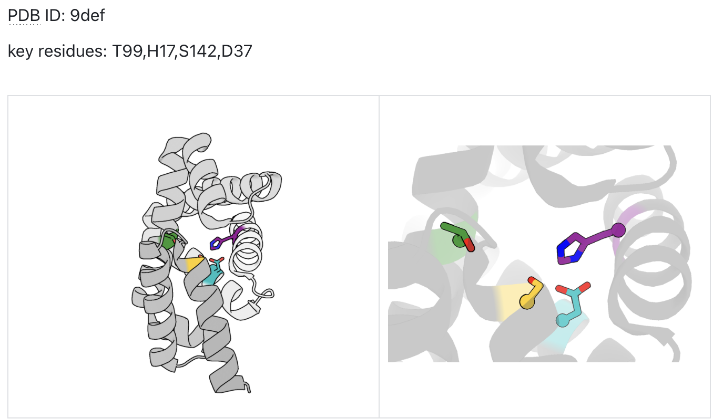

# Single Component Analysis Example: PDB 9def

This example demonstrates how to use the single component analysis template to highlight key residues in a protein structure.

## Overview

- **PDB ID**: 9def
- **Analysis Type**: Single component residue analysis
- **Key Residues**: T99, H17, S142, D37
- **Purpose**: Highlight catalytic and binding site residues

## Step-by-Step Process

### 1. Launch PyMOL
```bash
pymol -R
```

### 2. Configure Analysis in Claude Desktop

**Template**: `single_component_analysis`

**Parameters**:
- **Structure**: `9def`
- **Key_residues**: `99,17,142,37`
- **Distance_pairs**: (Optional) `99:CA-17:CA`

### 3. Expected Results

The visualization will show:
- **Protein backbone**: Semi-transparent dark gray cartoon representation
- **Key residues**: High-contrast colored stick and sphere representations
- **Unique coloring**: Each key residue assigned a distinct color
- **Distance measurements**: If specified, atomic distances displayed

## Visual Output



**Figure Description**: 
- Left panel: Overview of the protein structure with highlighted key residues
- Right panel: Close-up view focusing on the key residues with enhanced visibility

## Key Features Demonstrated

1. **Residue Highlighting**: Each of the four key residues (99, 17, 142, 37) is clearly visible with distinct colors
2. **Backbone Context**: The semi-transparent backbone provides structural context
3. **Spatial Relationships**: Clear visualization of how key residues relate spatially
4. **Professional Rendering**: Publication-quality output suitable for research presentations

## Technical Details

### Residue Specifications
- **99**: Likely catalytic residue (originally T99)
- **17**: Binding site residue (originally H17)  
- **142**: Structural residue (originally S142)
- **37**: Functional residue (originally D37)

### Rendering Settings Applied
- Cartoon representation for backbone
- Stick + sphere representation for key residues
- Semi-transparent surfaces
- Optimized lighting and colors
- High-quality ray tracing

## Usage Tips

1. **Residue Format**: Use numeric format (99) rather than with amino acid letters (T99) for better parsing
2. **Chain Specification**: If multiple chains, use format `A:99,B:17`
3. **Distance Measurements**: Add distance pairs to quantify spatial relationships
4. **Image Saving**: Save high-resolution images during pause points

## Customization Options

This example can be modified for different analyses:

### Active Site Analysis
```
Structure: 9def
Key_residues: 99,17,142
Distance_pairs: 99:CA-17:CA,17:CA-142:CA
```

### Mutation Study
```
Structure: 9def
Key_residues: 99,150,200
Distance_pairs: 99:CA-150:CA
```

### Binding Pocket Visualization
```
Structure: 9def
Key_residues: 17,37,99,142,180
```

## Next Steps

1. Try modifying the key residues list
2. Add distance measurements between specific atoms
3. Export high-resolution images for publication
4. Compare with related structures using the same analysis template

## Related Examples

- [Multi-Component Analysis: 1bd2](../multi_component/1bd2_example.md)
- [PD-L1 Binder Analysis](../multi_component/pdl1_binder_example.md)
